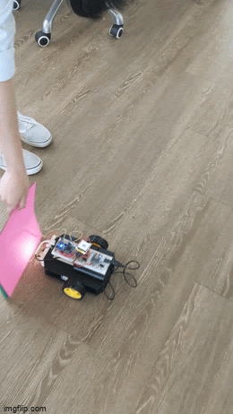
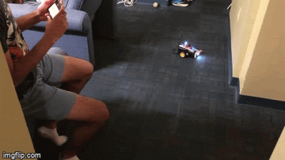

## Color Sensing RC Car

### Overview

The purpose of this project was to make a remote controlled robot using our phone that is able to detect the color of its surroundings. The robot accomplished those well, including being easy to drive using a phone app and bluetooth. We sent the color captured from the color sensor to a LCD on the top of the robot. We also investiaged having it use a distance sensor to control stopping in front of obstacles, but due to a conflict of limited serial and I2C pins, that feature is not possible while also having the LCD enabled.

### Features

- Robust Drivetrain System
- RTOS Thread-based Programming
- Easy Remote Control Using Phone Accelerometer

- Color Sensor and uLCD Display

- Optional Distance Sensor

### Materials

- [Sparkfun Shadow Robot Chassis](https://www.sparkfun.com/products/13301)
- 2x [DG01D Motors](https://www.sparkfun.com/products/13302)
- 4x AA Batteries with [Holder](https://www.sparkfun.com/products/9835)
- USB Battery Pack
- USB Micro B Cable
- 2x Breadboard
- [mBed](https://www.sparkfun.com/products/9564)
- [uLCD-144G2 LCD Screen](https://www.sparkfun.com/products/11377)
- [Bluefruit Bluetooth Module](https://www.adafruit.com/product/2479)
- [TCS34725 Color Sensor](https://www.adafruit.com/product/1334)
- [VL53L0X Time of Flight Sensor](https://www.adafruit.com/product/3317)
- [TB6612FNG H-Bridge](https://www.sparkfun.com/products/14450)
- Barrel Jack
- Power Switch

### Assembly Instructions

First, we assembled the robot chassis following this [guide](https://learn.sparkfun.com/tutorials/assembly-guide-for-redbot-with-shadow-chassis?_ga=2.58909997.1625431823.1620084318-527652614.1619801898). We then added 2 DC motors as our main actuators and 4 AA batteries along with the USB battery pack for our main power source using double sided tape. We then assembled the circuit on two breadboards following the following schematic.

We then mounted the breadboards to the frame using more tape and zip ties. We then put the batteries in the holder and put that inside the robot, and connected that power to the breadboard. Finally, we connected the USB cable to power the 5V rail from the USB battery pack.

### Videos

<iframe width="560" height="315" src="https://www.youtube.com/embed/vTKceMmFgSQ" frameborder="0" allow="autoplay; encrypted-media" allowfullscreen></iframe>

<iframe width="560" height="315" src="https://www.youtube.com/embed/JGAJsVZTDLc" frameborder="0" allow="autoplay; encrypted-media" allowfullscreen></iframe>

### Photos

### Resources
- [Project GitHub](https://github.com/ashbhan/ece4180-project)
- [mBed Documentation](https://os.mbed.com/handbook/Homepage)

### Future Work
- Use a 5V regulator instead of USB battery pack for 5V rail
- Use a more accurate color sensor able to better capture color
- Use a better distance sensor that more easily integrates into our mBed pinout
