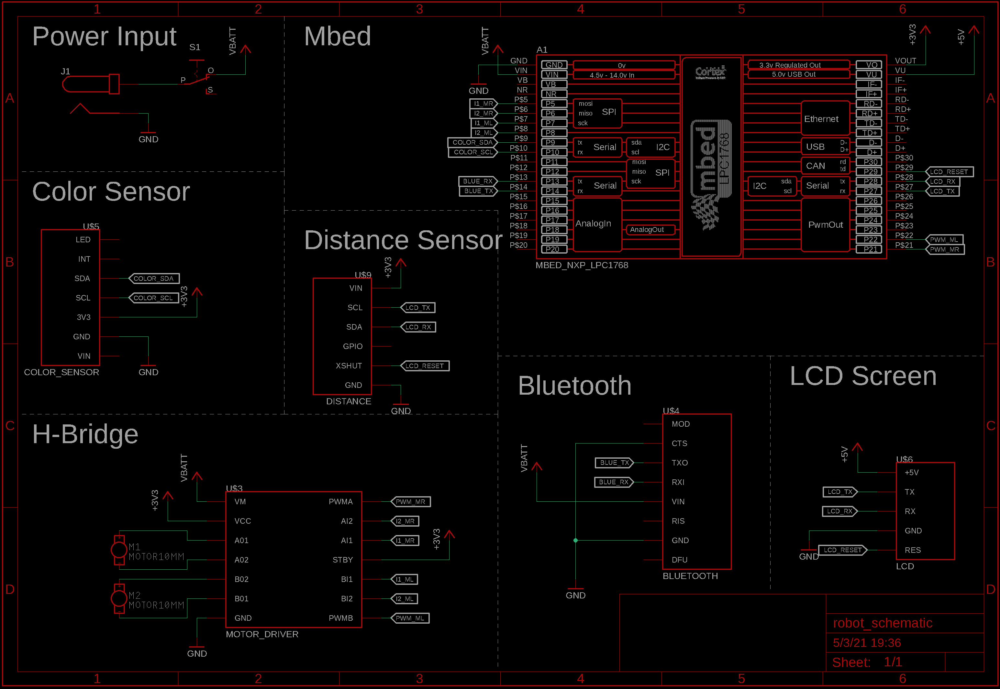
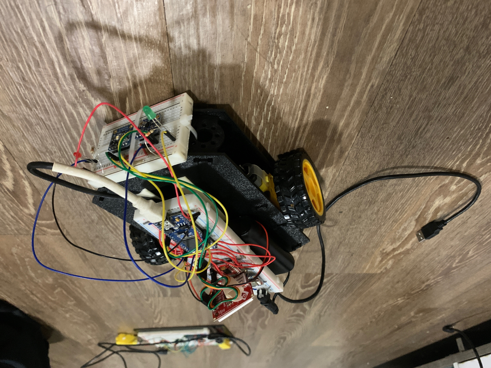
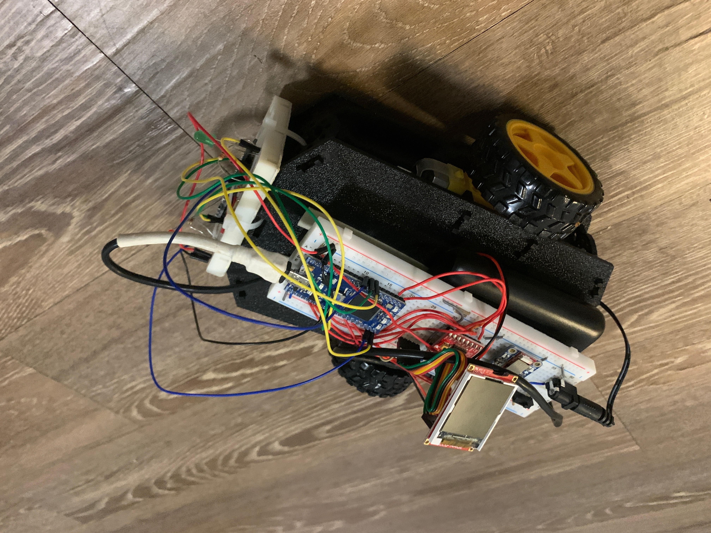
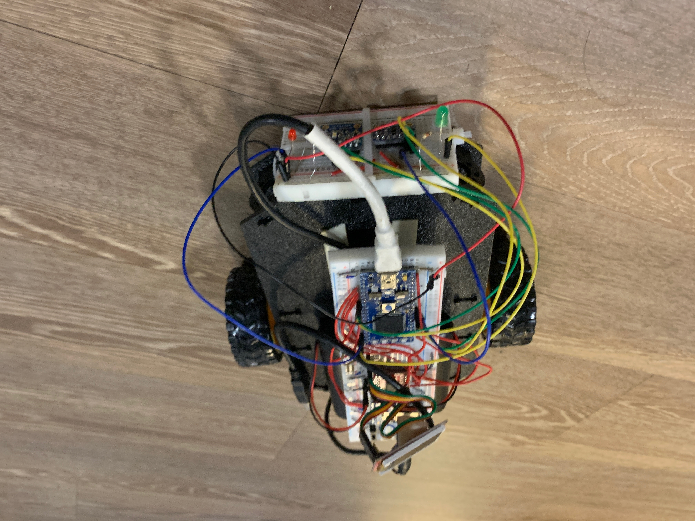

## Color Sensing RC Car

You can use the [editor on GitHub](https://github.com/ashbhan/ece4180-project/edit/gh-pages/index.md) to maintain and preview the content for your website in Markdown files.

### Overview

Markdown is a lightweight and easy-to-use syntax for styling your writing. It includes conventions for

```markdown
Syntax highlighted code block

# Header 1
## Header 2
### Header 3

- Bulleted
- List

1. Numbered
2. List

### Materials

- [Sparkfun Shadow Robot Chassis](https://www.sparkfun.com/products/13301)
- 2x [DG01D Motors](https://www.sparkfun.com/products/13302)
- 4x AA Batteries with [Holder](https://www.sparkfun.com/products/9835)
- USB Battery Pack
- USB Micro B Cable
- 2x Breadboard
- [mBed](https://www.sparkfun.com/products/9564)
- [uLCD-144G2 LCD Screen](https://www.sparkfun.com/products/11377)
- [Bluefruit Bluetooth Module](https://www.adafruit.com/product/2479)
- [TCS34725 Color Sensor](https://www.adafruit.com/product/1334)
- [VL53L0X Time of Flight Sensor](https://www.adafruit.com/product/3317)
- [TB6612FNG H-Bridge](https://www.sparkfun.com/products/14450)
- Barrel Jack
- Power Switch

### Assembly Instructions

First, we assembled the robot chassis following this [guide](https://learn.sparkfun.com/tutorials/assembly-guide-for-redbot-with-shadow-chassis?_ga=2.58909997.1625431823.1620084318-527652614.1619801898). We then added 2 DC motors as our main actuators and 4 AA batteries along with the USB battery pack for our main power source using double sided tape. We then assembled the circuit on two breadboards following the following schematic.



We then mounted the breadboards to the frame using more tape and zip ties. We then put the batteries in the holder and put that inside the robot, and connected that power to the breadboard. Finally, we connected the USB cable to power the 5V rail from the USB battery pack.

### Videos

<iframe width="560" height="315" src="https://www.youtube.com/embed/vTKceMmFgSQ" frameborder="0" allow="autoplay; encrypted-media" allowfullscreen></iframe>

<iframe width="560" height="315" src="https://www.youtube.com/embed/JGAJsVZTDLc" frameborder="0" allow="autoplay; encrypted-media" allowfullscreen></iframe>

### Photos








### Resources
- [Project GitHub](https://github.com/ashbhan/ece4180-project)
- [mBed Documentation](https://os.mbed.com/handbook/Homepage)
